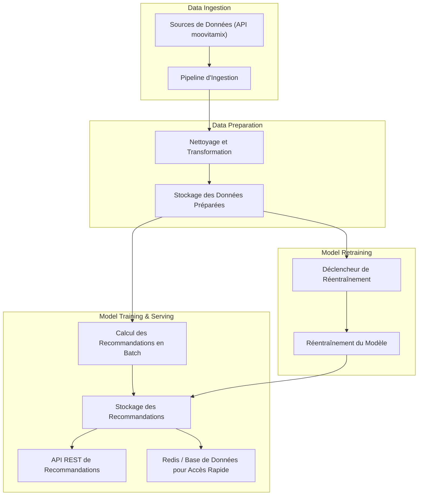

Pour automatiser le calcul des recommandations, une architecture en plusieurs étapes peut être mise en place, centrée autour de l’extraction, de la préparation des données, du calcul des recommandations et de la mise à jour continue des modèles de Machine Learning. Voici une approche détaillée, accompagnée d’un schéma explicatif pour illustrer le flux de données et les étapes du calcul des recommandations.

# Architecture et Étapes pour l’Automatisation du Calcul des Recommandations

1.	Extraction des Données (Data Ingestion) :
* Les données sont extraites quotidiennement depuis différentes sources : historiques d’écoute, informations utilisateur, catalogues de chansons.
* Technologies : Un orchestrateur comme Dagster peut être utilisé pour automatiser l’ingestion et le suivi des données.
2.	Pipeline de Préparation des Données :
* Les données extraites sont nettoyées, transformées, et préparées pour être utilisées dans le modèle de recommandation.
* Cette étape comprend :
* Le nettoyage des données (suppression des valeurs nulles, normalisation des genres musicaux).
* L’extraction des caractéristiques nécessaires (par exemple, fréquence d’écoute, préférences musicales).
* Technologies : Apache Spark pour le traitement distribué des données volumineuses, Pandas pour les transformations plus simples.
3.	Stockage des Données Préparées :
* Les données prêtes pour les recommandations sont stockées dans un entrepôt de données ou un data lake pour une utilisation rapide par les algorithmes de recommandation.
* Technologies : Amazon S3, Google BigQuery, ou une base analytique SQL.
4.	Calcul des Recommandations en Batch :
* Un calcul par lots génère des recommandations à intervalles réguliers (par exemple, toutes les nuits) pour chaque utilisateur.
* L’algorithme de recommandation est appliqué sur les données d’écoute et les préférences des utilisateurs. Différentes techniques peuvent être utilisées, telles que :
* Filtrage collaboratif (basé sur des similarités entre utilisateurs ou éléments).
* Modèles basés sur le contenu (en analysant les caractéristiques des chansons).
* Apprentissage profond (modèles tels que Word2Vec pour des embeddings musicaux).
* Technologies : Apache Spark MLlib pour le filtrage collaboratif distribué, ou TensorFlow/PyTorch pour les modèles d’apprentissage profond.
5.	Stockage des Recommandations :
* Les recommandations calculées sont sauvegardées dans une base de données dédiée aux recommandations pour une récupération rapide par les applications front-end.
* Technologies : Redis pour les recommandations en mémoire et les applications en temps réel, ou PostgreSQL/Cassandra pour les recommandations persistantes.
6.	Mise en Production des Recommandations :
* Une API REST est déployée pour que les applications client puissent récupérer les recommandations pour chaque utilisateur.
* L’API peut servir les recommandations calculées ou calculer des recommandations en temps réel si les données sont volumineuses.
* Technologies : FastAPI ou Flask pour l’API REST, avec une intégration avec Redis ou PostgreSQL pour la récupération rapide des données.
7.	Réentraînement Automatique des Modèles :
* Le modèle est régulièrement réentraîné en fonction de la fréquence des changements de données (ex. : tous les mois ou lors de changements significatifs dans les préférences des utilisateurs).
* Des pipelines de réentraînement automatisés sont configurés pour extraire les nouvelles données, entraîner le modèle, et évaluer sa performance.
* Technologies : MLflow pour le suivi des modèles, Apache Airflow ou Dagster pour orchestrer le réentraînement.

## Schéma du Pipeline de Recommandations Automatisé

## Explications Complémentaires du Schéma

* **Data Ingestion** : Les données sont ingérées quotidiennement depuis diverses sources et centralisées dans une zone de traitement.
* **Data Preparation** : Les données sont nettoyées et transformées pour obtenir des caractéristiques exploitables par les modèles de recommandation.
* **Model Training & Serving** : Les recommandations sont calculées en batch, stockées, puis mises à disposition via une API REST pour des applications externes.
* **Model Retraining** : Le modèle de recommandation est régulièrement réentraîné pour s’ajuster aux nouvelles données et aux évolutions dans les préférences des utilisateurs.