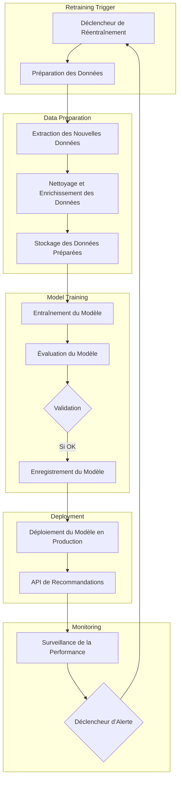

Pour automatiser le réentraînement du modèle de recommandation, une approche modulaire et orchestrée est essentielle pour gérer efficacement le flux de données, le réentraînement et le déploiement du modèle. Voici les étapes détaillées pour concevoir ce processus, avec un schéma pour illustrer le pipeline.

Architecture et Étapes pour l’Automatisation du Réentraînement

1.	Déclencheur de Réentraînement (Retraining Trigger) :
* Le déclencheur peut être basé sur un intervalle de temps (ex. : réentraînement mensuel) ou sur une analyse des données (ex. : dès que 20% de nouvelles données sont ingérées).
* Le déclencheur génère un événement qui active le pipeline de réentraînement.
* Technologies : Planification via Apache Airflow, Dagster ou un orchestrateur de tâches.
2.	Préparation des Données pour le Réentraînement :
* Le pipeline de préparation des données extrait les nouvelles données d’écoute et de préférences depuis l’entrepôt de données.
* Traitement des Données : Les données sont nettoyées, normalisées, et mises en forme pour être utilisées dans l’entraînement du modèle.
* Enrichissement des Données : Cette étape peut inclure des calculs de nouvelles caractéristiques ou des agrégations.
* Technologies : Apache Spark pour les transformations distribuées, Pandas pour les transformations locales.
3.	Entraînement et Évaluation du Modèle :
* Entraînement : Le modèle est entraîné en utilisant les données d’écoute et les caractéristiques utilisateur pour produire des recommandations.
* Évaluation : Une fois le modèle entraîné, il est évalué sur des métriques spécifiques (ex. : précision, rappel, taux de clics simulés) pour vérifier sa performance.
* Sélection de Modèle : Si le nouveau modèle surpasse l’ancien en termes de performance, il est validé pour le déploiement.
* Technologies : TensorFlow, PyTorch pour l’entraînement et l’évaluation des modèles, et MLflow pour le suivi des versions et des performances du modèle.
4.	Enregistrement et Gestion des Modèles :
* Le modèle validé est sauvegardé dans un registre de modèles pour garantir une gestion structurée des versions et pour faciliter le déploiement.
* Gestion des Versions : Chaque modèle est versionné, ce qui permet de suivre l’historique des performances et de revenir à un modèle précédent en cas de besoin.
* Technologies : MLflow Model Registry, TensorFlow Model Server pour l’enregistrement des modèles.
5.	Déploiement Automatisé du Modèle :
* Une fois le modèle validé et enregistré, il est déployé en production pour être utilisé dans les recommandations.
* Le déploiement peut être réalisé via une API REST qui expose les recommandations en temps réel.
* Techniques de Déploiement : Le déploiement peut se faire avec une stratégie de déploiement progressif (ex. : canary deployment) pour tester le modèle sur une fraction des utilisateurs avant de le déployer complètement.
* Technologies : FastAPI ou Flask pour l’API de prédiction, Kubernetes pour l’orchestration de conteneurs en production.
6.	Surveillance et Suivi en Production :
* Une fois en production, le modèle est surveillé pour détecter d’éventuelles dégradations de performance, comme une dérive des données ou une baisse des performances.
* Métriques de Surveillance : Taux de clics, taux de conversion, taux de rejet des recommandations, précision.
* Alerte Automatique : En cas de baisse significative de performance, une alerte déclenche le réentraînement du modèle.
* Technologies : Grafana, Prometheus, ou Datadog pour le monitoring.

Schéma du Pipeline de Réentraînement Automatisé

Explications Complémentaires du Schéma

1.	Déclencheur de Réentraînement : Active le pipeline lorsque de nouvelles données sont disponibles ou à intervalles réguliers.
2.	Préparation des Données : Met en forme les données pour les rendre compatibles avec l’entraînement du modèle.
3.	Entraînement et Validation : Entraîne le modèle et valide ses performances ; seuls les modèles performants sont enregistrés.
4.	Déploiement : Automatiquement déployé si le modèle est validé, avec un accès via une API de recommandation.
5.	Surveillance et Alerte : Surveillance continue des performances du modèle en production ; une dégradation entraîne un nouveau déclenchement de réentraînement.
